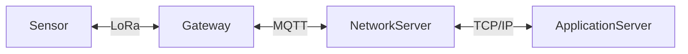
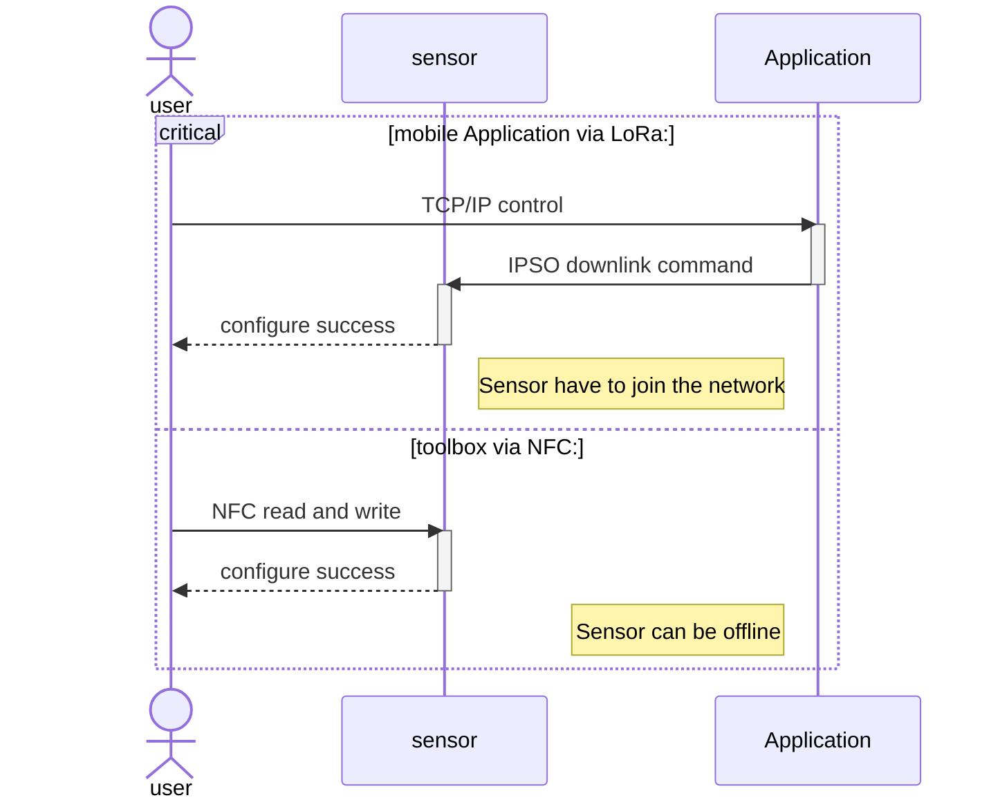

# Classic LoRa Topology

```mermaid
flowchart LR

Sensor <--LoRa--> Gateway <--MQTT--> NetworkServer <--TCP/IP--> ApplicationServer

```

```mermaid
sequenceDiagram

actor a as user
participant S as sensor
participant A as Application

critical mobile Application via LoRa:

a->>A:TCP/IP control
activate A
A->>S:IPSO downlink command
deactivate A
activate S
S-->>a:configure success
deactivate S
Note left of A:Sensor have to join the network

option toolbox via NFC:

a->>S:NFC read and write
activate S
S-->>a:configure success
deactivate S
Note left of A:Sensor can be offline
end
```