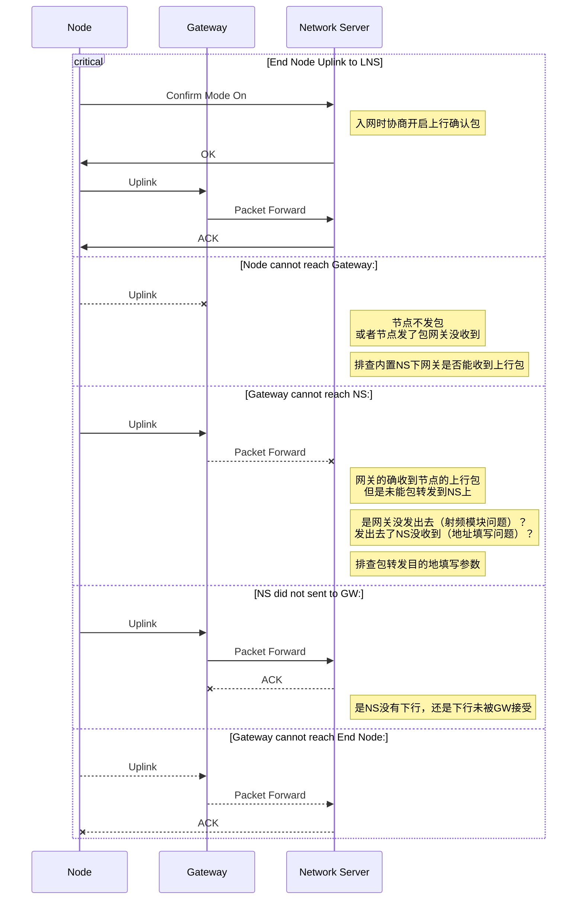

要想减少丢包，主要要确保网络环境要好，比如设备的信号强度，信噪比，以及信号的拥挤程度。其次可以通过配置启用一些机制，来确保链路的连通状态，数据包的成功接收。

1. 节点要有数据（传感器探头）
2. 节点射频模块要正常（LoRa模块）
3. 节点和网关要连通（网络环境）
4. 网关的接受模块要正常（LoRa模块）
5. 网关的包转发功能是否正常（网关包转发）
6. 网关包转发协议是否正确配置（目的地是否ping的通）
7. NS本身的接收是否正常（NS本身也有可能抽风）

主要的排查思路就是对照实验。

